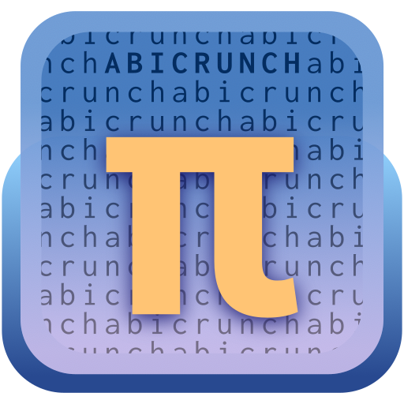

<h1 style="text-align: center;">AbiCrunch</h1>

**Abicrunch is a browser-based high-precision scientific calculator similar to SpeedCrunch.**

AbiCrunch is developed with the Finnish matriculation examination system in mind,
it should provide a familiar enough interface and usage experience to students who have learned to use SpeedCrunch.

## Technology used
- 🚀 React + TypeScript
- 🔢 Parsing based on a built-in fork of [expr-eval](https://github.com/silentmatt/expr-eval) patched with [Decimal.js](https://github.com/MikeMcl/decimal.js)

## ⚠️ Disclaimer ⚠️
**This software is still in a fragile beta testing phase.**
Do not expect it to work properly. Do not trust it for doing important calculations.

## Current state

### Implemented and working
- ✅ All basic calculations of expr-eval with Decimal.js
- ✅ Angle degree/radian modes for trigonometry
- ✅ User-defined functions and variables
- ✅ Configurable precision (decimals and exponent notation)
- ✅ Command palette
- ✅ Variable palette

### To-Do list
- ⏳️ On-screen keypad
- ⏳️ More built-in functions
    - ⏳️ Statistical functions: `average`, `geomean`, `median`, `product`, `variance`, `stddev`, `absdev`
    - ⏳️ Distribution functions 
    - ⏳️ Complex number support
- ⏳️ Support for comma based `,` decimal notation
- ⏳️ Help & hints for command palette
- ⏳️ User guide and help pages
- ⏳️ "Value of selection"
- ⏳️ Parsing and evaluation in a web worker (+ calculation timeout)
- ⏳️ Creating an actual fork of expr-eval

### "Maybe in the future" (list of non-essential ideas)
- ❓️ Support parsing TeX expressions (e.g. `\frac{1}{2}` => `1/2`)

### Not going to be implemented
- 🚫 Any CAS-like features (e.g. derivatives, integrals, smart simplification, etc.)
- 🚫 Built-in book of formulas (as Abitti®️ has multible tables built in)

-----

## Contributing
Contributions are welcome. Feel free to fork this repository and to suggest changes with pull requests. Please stay in line with the code style and 

## License
MIT
