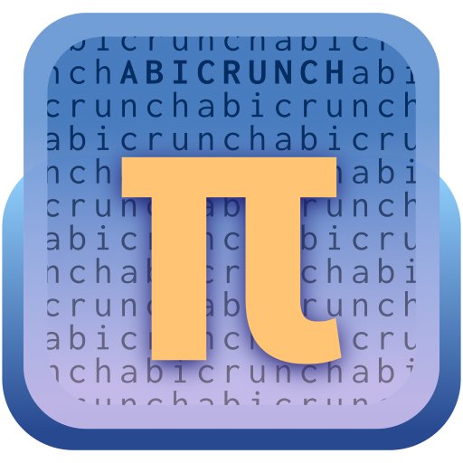

<p align="center" width="100%">

<h1 style="text-align: center;">Kräks 🧮</h1>
<p style="text-align: center;"><small>(also known as AbiCrunch)</small></p>
</p>

----

**Kräks** is a browser-based high-precision scientific calculator similar to [SpeedCrunch](https://heldercorreia.bitbucket.io/speedcrunch/).

The Finnish Matriculation Examination Board (YTL/MEB) decided to drop SpeedCrunch and similar calculators from the official examination system. Thus, the goal of this project no longer aims to recreate the SpeedCrunch experience on the web.

## The main goals
- Developing a general purpose scientific calculator for online use and embedding in [L'Math](https://lehtodigital.fi/lmath/) 
- Providing an "exam calc" mode, attempting to replicate the calculator functionality of [yet another Finnish exam system](https://testikoe.korkeakouluun.fi/laskin/examination.fi.html)

## Technologies used
- React + TypeScript
- Parsing based on a "monorepo-ish" fork of [expr-eval](https://github.com/silentmatt/expr-eval) patched with [Decimal.js](https://github.com/MikeMcl/decimal.js)

## ⚠️ Disclaimer ⚠️
**This software is still in a fragile beta testing phase.**
Do not expect it to work properly. Do not trust it for doing important calculations.

## Configuring with URL parameters
Following URL parameters are supported for changing the configuration:
- `view=standalone`, makes the calculator usable in a regular big browser window
- `mode=simple`, changes into "simple mode" for casual embedding purposes
- `mode=exam`, changes into "Vallu mockup mode" for the "Valintakoelaskin" replica
- `prefs=...`, sets any preferences or options, such as following:
```json
{
    "lang": "fi",  // "fi" or "en"
    "isSidebarVisible": true,
    "isKeypadVisible": true,
    "isDegrees": false,
    "shouldCleanTrigonometry": true,
    "precision": 50,
    "expLimit": 15,
    "outputMode": "decimal"
}
```

## Current state

**👉️ [Live demo](https://crunch.lehtodigital.fi/?view=standalone)**

### Implemented and working
- ✅ All basic calculations of expr-eval with Decimal.js
- ✅ Supports both dot `.` and `,` comma as decimal separator
- ✅ Angle degree/radian modes for trigonometry
- ✅ User-defined functions and variables
- ✅ Configurable precision (decimals and exponent notation)
- ✅ Command palette
- ✅ Variable palette
- ✅ On-screen keypad
- ✅ Prefs/settings saved in localStorage

### To-Do list
- ⏳️ Thoroughly test all built-in functions
- ⏳️ Improve trig function accuracy and rounding...
- ⏳️ More built-in functions
    - ⏳️ More statistical functions
    - ⏳️ More distribution functions 
    - ⏳️ Complex number support?
- ⏳️ Improve built-in guide
- ⏳️ "Value of selection"?
- ⏳️ Improve user experience of special modes
- ⏳️ Create an actual fork of expr-eval instead of current approach

### "Maybe in the future" (list of non-essential ideas)
- ❓️ Support parsing TeX expressions (e.g. `\frac{1}{2}` => `1/2`)

### Not going to be implemented
- 🚫 Any CAS-like features (e.g. derivatives, integrals, smart simplification, etc.)
- 🚫 Built-in book of formulas (as Abitti®️ has multible tables built in)


## Screenshots

 


-----

## Contributing
Contributions are welcome, especially if they contain improvements that help the actual users. Feel free to fork this repository and to suggest changes with pull requests. Please stay in line with the existing code style. Please also read the general goal(s) of this project higher above.

## License
MIT

## Legal notice
The original name "AbiCrunch" refers to "Abi", as in "Abiturientti" and "Crunch" like quickly crunching through mathematical calculations.

This project is not affiliated with or officially approved by the Finnish Matriculation Examination Board (YTL) and is not related to the the Abitti&reg; examination system. Abitti&reg; is a registered trademark of the Finnish Matriculation Examination board.


